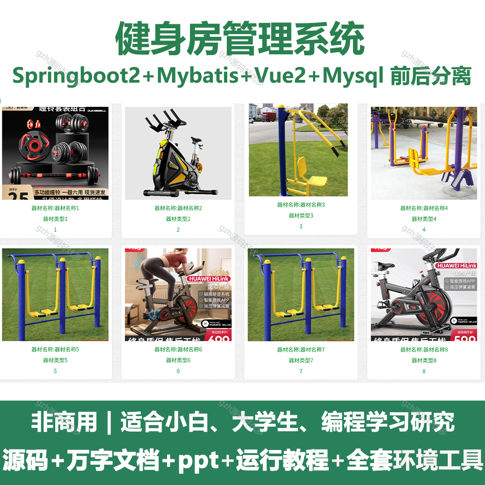
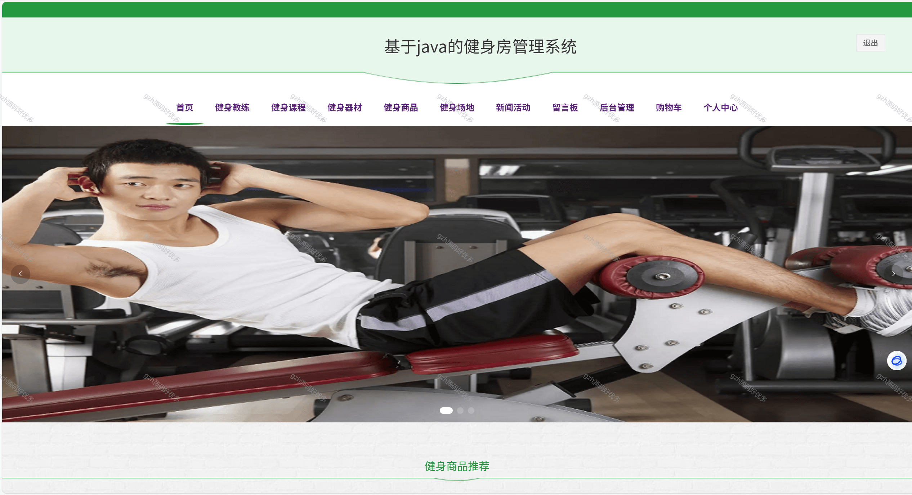
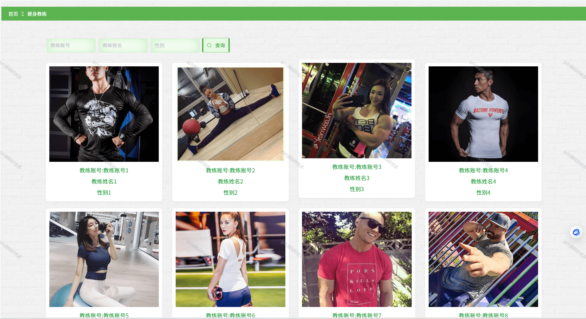
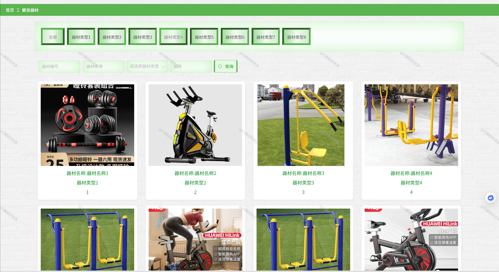
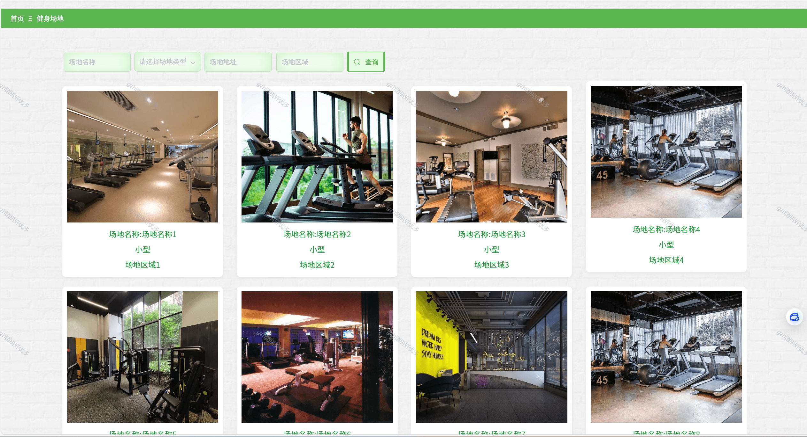
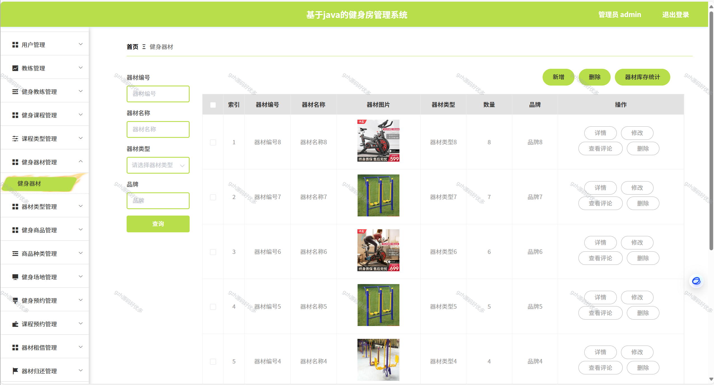
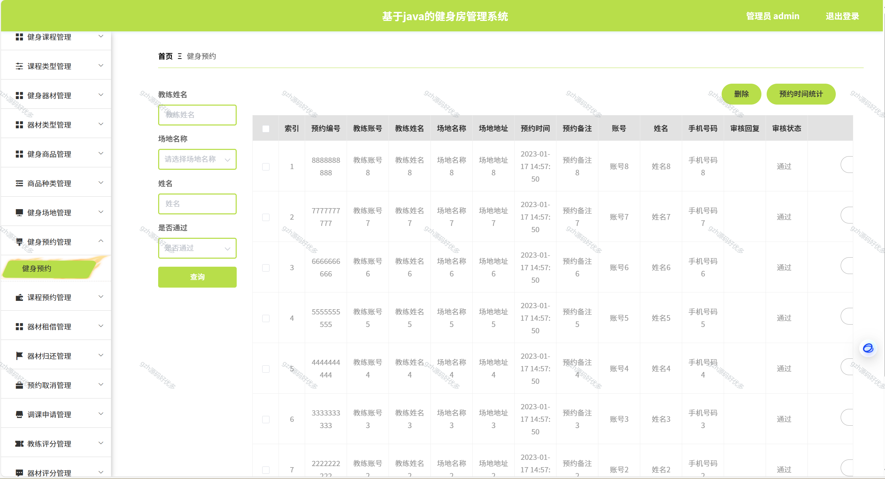
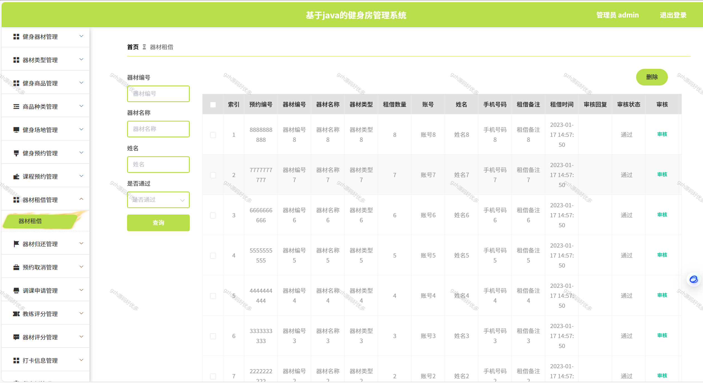
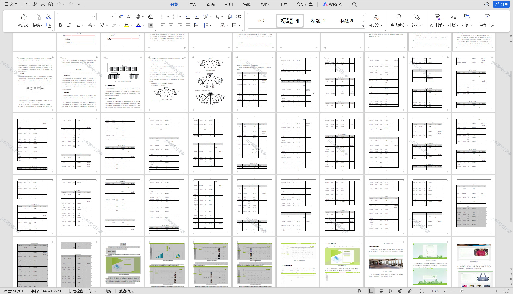

# springbootA262
springbootA262健身房管理系统
 
## 查看主页获取源码

### 一、关键词
健身中心管理系统，健身房运营管理系统，健身会所管理系统

### 二、作品包含
源码+数据库+设计文档万字+全套环境和工具资源+本地部署教程

### 三、项目技术
前端技术：Html、Css、Js、Vue2.0、Element-ui 
后端技术：Java、SpringBoot2.0、MyBatis

### 四、运行环境（以下版本亲测，其他版本兼容性请自行测试）
开发工具：IDEA/eclipse  + VSCODE

数据库：MySQL5.7（最低要5.7版本）

数据库管理工具：Navicat10以上版本

环境配置软件： JDK1.8 + Maven3.6.3

前端Nodejs：14

浏览器：谷歌浏览器

### 五、项目介绍
项目编号：springbootA262

健身房管理的以往工作流程繁杂、多样、管理复杂与设备维护繁琐。而如今计算机已完全能够胜任健身房管理工作，而且更加准确、方便、快捷、高效、清晰、透明，它完全可以克服以上所述的不足之处。这将给查询信息和管理带来很大的方便，从而给健身房管理者带来更高的效率，这也是健身房管理正规化、现代化的重要标志。
系统分成管理员控制模块和用户、教练模块。管理员可以管理用户信息、教练信息、健身教练、健身课程、健身预约、课程预约、器材租借、器材归还、预约取消等。教练对健身课程、健身预约、课程预约等操作，用户可以查询健身预约、课程预约、器材租借、器材归还等和设定本人系统。本系统有良好的界面体验，功能基本齐全，让使用者体验度大大提升。

### 六、运行截图

